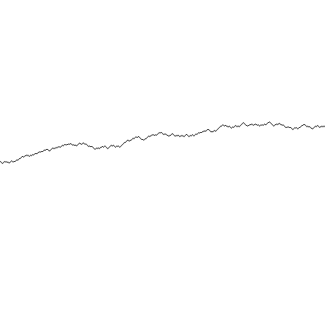

# BMP Generator – Linux IPC & UDP Visualization System


A Linux-based sensor measurement simulator written in **C**, capable of generating **1-bit BMP chart visualizations** from simulated measurement data.

The application demonstrates multiple **low-level system programming concepts**, including:

* **Inter-process communication (IPC)** using files and Linux signals
* **UDP socket communication**
* **Dynamic memory management**
* **Binary BMP file generation**
* **Linux `/proc` process lookup**
* **Signal handling**
* **Multi-threaded execution using OpenMP**

The project was developed as a system-level programming assignment and focuses on combining several Linux programming concepts into a single working application.

---

# Features

✔ **Random sensor measurement simulation** using constrained random walk logic
✔ **1-bit BMP chart generation** without external graphics libraries
✔ **File-based communication** between sender and receiver processes
✔ **UDP socket-based communication** over localhost (`127.0.0.1`)
✔ **Linux signal handling** (`SIGINT`, `SIGUSR1`, `SIGALRM`)
✔ **Dynamic memory allocation** for measurement storage
✔ **Automatic process discovery** via Linux `/proc` filesystem
✔ **Command-line interface with multiple execution modes**
✔ **Multi-threaded version information display using OpenMP**

---

# Example Output

The generated chart visualizes simulated sensor measurements over time.

Example:



---

# Project Architecture

The application supports two communication mechanisms.

## File-based IPC

```text
Sender Process
      ↓
 Measurement()
      ↓
SendViaFile()
      ↓
Measurement.txt
      ↓
SIGUSR1 signal
      ↓
Receiver Process
      ↓
ReceiveViaFile()
      ↓
BMPcreator()
      ↓
chart.bmp
```

## UDP Socket Communication

```text
Sender Process
      ↓
 Measurement()
      ↓
SendViaSocket()
      ↓
UDP localhost:3333
      ↓
ReceiveViaSocket()
      ↓
BMPcreator()
      ↓
chart.bmp
```

---

# Project Structure

```text
BMP-generator/
│── main.c
│── MyTools.c
│── MyTools.h
│── example_output.bmp
│── README.md
```

---

# Build Instructions

Compile the application using GCC:

```bash
gcc main.c MyTools.c -o chart
```

Run the executable:

```bash
./chart
```

---

# Usage

## Show help menu

```bash
./chart --help
```

Displays all supported execution modes and command-line options.

---

## Show version information

```bash
./chart --version
```

Displays:

* project information
* developer name
* build date
* course information

Version information is displayed using **parallel threads (OpenMP)**.

---

## Sender mode (default)

### File communication

```bash
./chart -send -file
```

or simply:

```bash
./chart
```

This mode:

1. Generates simulated measurement data
2. Saves values into `Measurement.txt`
3. Searches for a receiver process
4. Sends a `SIGUSR1` signal
5. Terminates

---

### Socket communication

Start receiver first:

```bash
./chart -receive -socket
```

Then sender:

```bash
./chart -send -socket
```

This mode:

1. Generates measurement data
2. Sends the number of values via UDP
3. Waits for acknowledgement
4. Sends the measurement array
5. Waits for final validation
6. Terminates

---

## Receiver mode

### File-based receiver

```bash
./chart -receive -file
```

The receiver waits indefinitely for a `SIGUSR1` signal.

Upon receiving a signal:

* `Measurement.txt` is read
* values are dynamically loaded into memory
* a BMP chart is generated
* memory is released

---

### Socket-based receiver

```bash
./chart -receive -socket
```

The receiver:

* listens on port `3333`
* waits for UDP packets
* validates received messages
* generates `chart.bmp`
* continues waiting for future requests

---

# Command Line Arguments

| Argument    | Description                  |
| ----------- | ---------------------------- |
| `--help`    | Display help information     |
| `--version` | Display project information  |
| `-send`     | Run in sender mode           |
| `-receive`  | Run in receiver mode         |
| `-file`     | Use file-based communication |
| `-socket`   | Use UDP socket communication |

### Notes

* Sender mode is the **default mode**
* File communication is the **default communication method**
* Argument order does **not matter**

Examples:

```bash
./chart -receive -socket
./chart -socket -receive
```

Both commands are equivalent.

---

# Technical Highlights

## 1. Manual BMP Binary Generation

The BMP image is generated manually by constructing:

* BMP headers
* color palette
* pixel data

without using any external graphics libraries.

The application creates a **1-bit bitmap image**, meaning each pixel occupies only **one bit of storage**.

---

## 2. Inter-Process Communication (IPC)

The application supports **file-based IPC** using:

* `Measurement.txt`
* Linux signals
* process synchronization

The sender automatically searches for the receiver process and notifies it using `SIGUSR1`.

---

## 3. UDP Communication

A custom UDP communication flow was implemented:

1. Send measurement count
2. Wait for acknowledgement
3. Send measurement array
4. Validate transmitted byte size

This mechanism helps ensure transmission integrity.

---

## 4. Linux `/proc` Process Discovery

The application scans the Linux `/proc` filesystem to find active receiver processes automatically.

This allows sender and receiver processes to communicate without manually entering process IDs.

---

## 5. Signal Handling

The following Linux signals are supported:

| Signal    | Purpose                         |
| --------- | ------------------------------- |
| `SIGINT`  | Graceful program termination    |
| `SIGUSR1` | File communication notification |
| `SIGALRM` | Socket timeout handling         |

---

## 6. Dynamic Memory Management

Measurement arrays are dynamically allocated at runtime depending on:

* current system time
* elapsed seconds in the quarter-hour
* minimum threshold of 100 measurements

Allocated memory is released after processing.

---

# System Requirements

* **Operating System:** Linux
* **Compiler:** GCC
* **Libraries Used:**

  * Standard C Library
  * POSIX sockets
  * OpenMP
  * Linux signal API

---

# Concepts Practiced

This project demonstrates practical usage of:

* System-level programming in C
* Dynamic memory allocation
* Binary file manipulation
* UDP networking
* Linux signals
* File I/O
* Process discovery
* Inter-process communication
* Multi-threading with OpenMP

---

# Future Improvements

Possible future extensions:

* GUI-based chart viewer
* Multiple chart color themes
* TCP communication support
* Configuration file support
* Performance optimization for large datasets

---

# Author

**Dániel Magyar**

Developed as part of a **System-Level Programming** university project.

